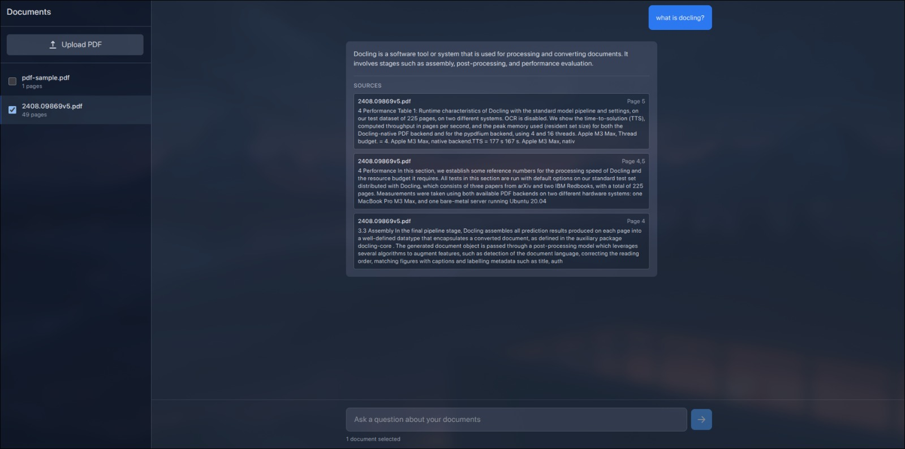

# 📄 PDF Question-Answering System

A **Retrieval-Augmented Generation (RAG)** system that enables users to upload PDF documents and ask questions about their content. The system processes PDFs, extracts relevant data, and leverages OpenAI models to provide accurate, reference-backed answers.



---

## 🏗 Architecture

This project consists of two main components:

- **Frontend** – A React application for document upload, selection, and chat interface  
- **Backend** – A FastAPI service that handles PDF parsing, embedding generation, vector storage, and answer synthesis

---

## ✨ Features

- Upload and process PDF documents
- Real-time upload progress tracking
- Select multiple documents to query simultaneously
- Ask natural language questions about documents
- View references used to generate each answer

---

## 🧰 Technologies Used

### Frontend
- React 19
- Tailwind CSS 4
- Vite 6
- SWC for fast builds

### Backend
- Python 3.10
- FastAPI
- [Haystack](https://haystack.deepset.ai/) for retrieval + generation pipeline
- [Docling](https://docling-project.github.io/docling/) for PDF chunking and parsing
- [ChromaDB](https://www.trychroma.com/) for vector storage
- Sentence Transformers for dense embeddings
- OpenAI API (GPT models) for answer generation

---

## ⚠ Note on Retrieval Strategy

While this project was originally designed for **hybrid retrieval** (BM25 + dense vectors), current limitations in the **Haystack-Chroma integration** prevent BM25 usage. As a result, this system currently supports **dense retrieval only**.

---

## 🚀 Getting Started

### Prerequisites

- Python 3.10+
- Node.js 18+
- OpenAI API Key
- uv

---

### 🔧 Backend Setup

```bash
cd backend
uv sync
uv run uvicorn main:app --reload
```


### 🔧 Frontend Setup

```bash
cd frontend
npm i
npm run dev
```
